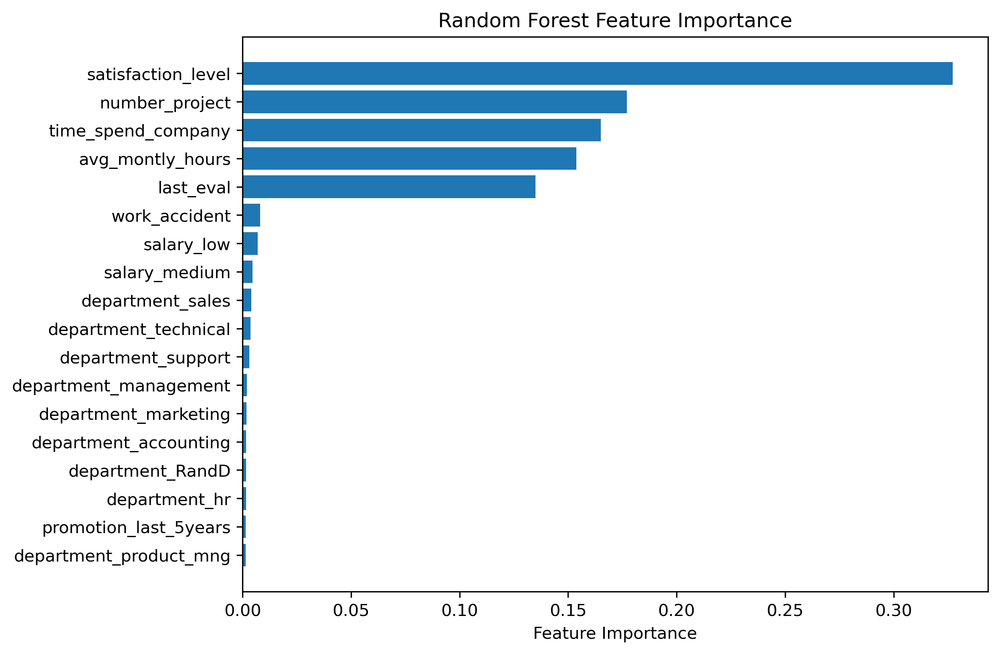

# Employee Attrition Prediction — Salifort Motors HR Analytics

Predicting which employees are likely to leave the company, using data-driven insights to guide HR retention strategy.

## Table of Contents
- [Business Problem](#business-problem)
- [Dataset](#dataset)
- [Approach](#approach)
- [Key Findings (EDA)](#key-findings-eda)
- [Modeling & Results](#modeling--results)
- [Business Recommendations](#business-recommendations)
- [Repository Structure](#repository-structure)
- [How to Run](#how-to-run)
- [Tech Stack](#tech-stack)
- [Author](#author)

## Business Problem

The HR department at Salifort Motors, a fictional consulting firm, wants to understand what drives employees to leave and to proactively identify employees at risk of attrition before they resign. Losing an employee is costly: recruiting, onboarding, and training a replacement takes significant time and money, and unplanned departures disrupt teams and projects.

This project answers two questions for HR:
1. **What factors are most strongly associated with an employee leaving?**
2. **Can we build a reliable model to flag employees who are likely to leave, so HR can intervene early?**

## Dataset

The data comes from a [Kaggle HR analytics dataset](https://www.kaggle.com/datasets/mfaisalqureshi/hr-analytics-and-job-prediction?select=HR_comma_sep.csv) containing **15,000 employee records** across 10 features, including:

| Feature | Description |
|---|---|
| `satisfaction_level` | Employee-reported job satisfaction (0–1) |
| `last_evaluation` | Score from the employee's last performance review (0–1) |
| `number_project` | Number of projects the employee is assigned to |
| `average_montly_hours` | Average hours worked per month |
| `time_spend_company` | Tenure in years |
| `Work_accident` | Whether the employee had a workplace accident |
| `promotion_last_5years` | Whether the employee was promoted in the last 5 years |
| `department` | Department the employee works in |
| `salary` | Salary level (low / medium / high) |
| `left` | **Target variable** — whether the employee left (1) or stayed (0) |

## Approach

The project follows the **PACE framework** (Plan, Analyze, Construct, Execute):

1. **Data cleaning** — fixed inconsistent column names, checked for missing values, removed ~3,000 duplicate rows, and examined outliers in tenure.
2. **Exploratory Data Analysis (EDA)** — visualized relationships between each feature and attrition to surface early patterns.
3. **Feature engineering** — one-hot encoded categorical variables (`department`, `salary`).
4. **Modeling** — trained and tuned a **Decision Tree** and a **Random Forest** classifier via `GridSearchCV`, using stratified train/validation/test splits, optimizing for **recall** (see rationale below).
5. **Evaluation** — compared models on precision, recall, F1, and accuracy, and examined feature importances.

## Key Findings (EDA)

- Employees who left reported noticeably **lower satisfaction levels** than those who stayed.
- Attrition was highest among employees with **either very few or very many projects** — both under- and over-utilization appear linked to leaving.
- Employees who left tended to **work more hours per month** on average.
- **No employee who left had been promoted in the last 5 years** — lack of career progression stands out as a strong signal.
- Attrition **decreases as salary level increases**.
- The **Sales and Technical** departments had the highest raw counts of attrition.
- `last_evaluation` and `Work_accident` showed weak relationships with attrition and were less useful as predictors.

## Modeling & Results

Because the cost of **missing** an employee who is about to leave (a false negative) is higher than the cost of flagging a stable employee unnecessarily (a false positive), the models were tuned to **prioritize recall**.

| Model | Precision | Recall | F1 | Accuracy |
|---|---|---|---|---|
| Decision Tree val | 0.827740 | 0.929648 | 0.875740 | 0.956214
| Random Forest val | 0.978552 | 0.917085 | 0.94682 | 0.982902
| Random Forest test | 0.986667 | 0.929648 | 0.957309 | 0.986244


The **Random Forest** model outperformed the Decision Tree and generalized well to unseen data, with validation and test scores closely matching training performance — indicating no significant overfitting.

**Top predictors of attrition** (Random Forest feature importance):



## Business Recommendations

- **Monitor and improve employee satisfaction** through regular surveys and feedback channels.
- **Watch workload extremes** — monitor employees with high workloads or long working hours to reduce the risk of burnout.
- **Revisit promotion practices** — conduct regular career development and performance discussions, particularly for employees who have spent several years at the company.


## Repository Structure

```
├── Salifort_Motors_project_lab.ipynb   # Full analysis notebook (EDA, modeling, evaluation)
├── HR_capstone_dataset.csv             # Dataset
├── requirements.txt                    # Python dependencies
└── README.md                           # Project overview (this file)
```

## How to Run

```bash
# Clone the repository
git https://github.com/Yousra-Chahinez/salifort-employee-retention-analysis.git
cd salifort-employee-retention-analysis

# Create a virtual environment (optional but recommended)
python -m venv venv
source venv/bin/activate   # on Windows: venv\Scripts\activate

# Install dependencies
pip install -r requirements.txt

# Launch the notebook
jupyter notebook Salifort_Motors_project_lab.ipynb
```

## Tech Stack

- **Python** — pandas, NumPy
- **Visualization** — Matplotlib, Seaborn
- **Modeling** — scikit-learn (Decision Tree, Random Forest, GridSearchCV)
- **Environment** — Jupyter Notebook

